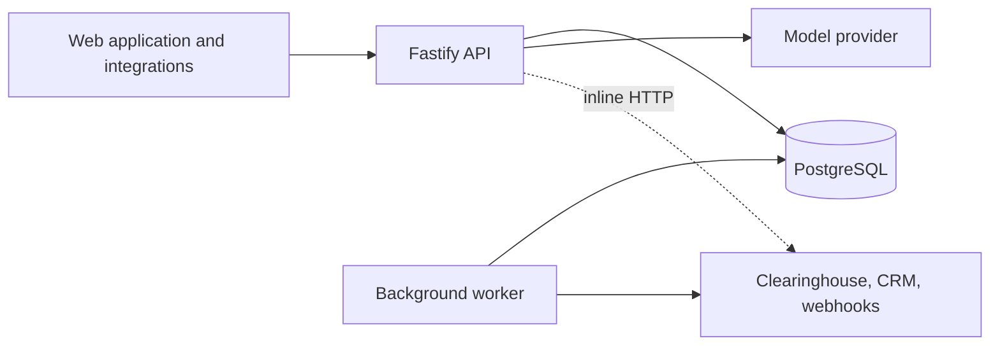
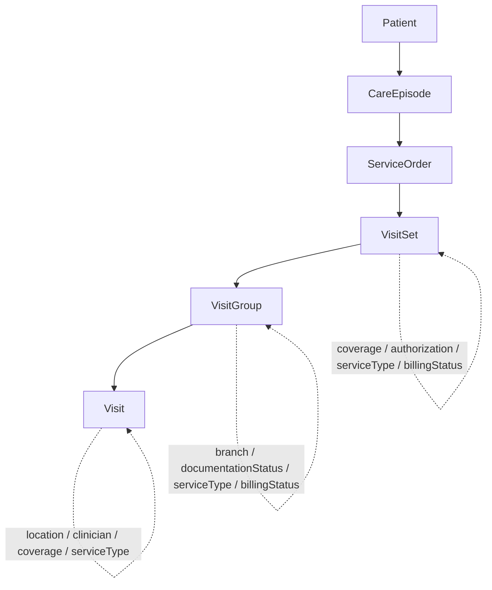
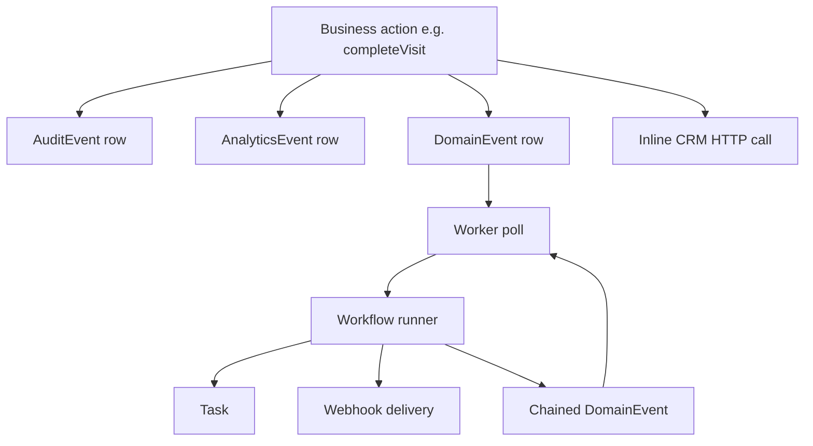

# Current Architecture

This document describes how the platform is built and deployed today. It is
written for engineers joining the team and reflects the system as it currently
runs, not a target state.

## Deployment

The platform is a single TypeScript modular monolith. It ships as two Node
processes that share one codebase, one Prisma schema, and one PostgreSQL
database:

- **API process** (`src/server.ts`, `src/app.ts`) — a Fastify application that
  serves the JSON API, the OpenAPI UI at `/docs`, and the browser SPA in
  `public/`. It handles all interactive traffic.
- **Background worker** (`src/worker.ts`) — a single-process loop that, every
  `workerPollIntervalMs`, drains pending `DomainEvent` rows through the workflow
  runner and then runs due background jobs (`processPendingEvents()` followed by
  `drainJobs()`).

Both processes talk to the same primary database. There is no read replica, no
separate reporting store, no cache tier, and no message broker: durable
asynchronous work is expressed as rows in PostgreSQL (`DomainEvent`, `JobRecord`,
`WebhookDelivery`) that the worker polls.

External systems — the claims clearinghouse, the customer CRM, outbound
webhook receivers, and the language model — are represented locally by
simulators that run inside the same process (`src/integrations/*`,
`src/http/routes/simulator-routes.ts`, `src/ai-employee/fake-model.ts`). No cloud
credentials or paid APIs are required.



## Domain modules

The application is organized as a modular monolith. Module boundaries are
directory and import conventions rather than separately deployed services; any
module may call any other, and several do. The `src/` tree contains roughly 145
source files and 8,900 lines across the following modules:

| Module | Responsibility |
|---|---|
| `intake` | Patient, coverage, eligibility, referral, and initial-order entry; duplicate detection; intake price estimates |
| `patients` | Patient directory, header, and record merge |
| `orders` | Service-order read paths, order price preview, authorization utilization and enforcement, order summary |
| `scheduling` | Calendar, capacity, visit scheduling, reschedule, cancel, and branch move |
| `visits` | Visit completion and lifecycle, visit lists and detail, visit counts, completion pricing, API DTO mapping |
| `documentation` | Clinical note entry, templates, signing, amendments, and documentation completeness |
| `pricing` | Rate-resolution paths, credential modifiers, rounding strategies, and price comparison |
| `revenue-cycle` | Charges, claim building and submission, clearinghouse client, rejections, corrections, statements |
| `accounting` | Month close, cash application, AR, postings, reconciliation, remittance import, accrual |
| `reporting` | Operational, revenue, census, aging, productivity, documentation, and custom reports; scheduled exports |
| `workflows` | Customer-editable automation: definitions, condition evaluation, action catalog, and the event runner |
| `ai-employee` | Experimental operational assistant: context builder, tools, agent loop, deterministic model, evaluation |
| `events` | Audit, analytics, ORM-hook wrappers, in-process event bus, durable domain events, and event-name constants |
| `integrations` | Clearinghouse simulator, CRM sync, webhook dispatch and management |
| `jobs` | Background job queue (`JobRecord`) and handlers |
| `permissions` | Legacy role checks, newer policy service and permission matrix, scope helpers, row filters, service identities |
| `audit` | Audit event recording and audit export |
| `custom-fields` | Per-customer custom field definitions and values |
| `search` | Global cross-entity search |
| `tasks` | Operational task records |
| `legacy` | snake_case record shapes, repositories, aggregates, and mappers over the visit hierarchy |
| `domain` | Domain models for patient, coverage, and money |
| `config` | Environment, feature flags, and per-customer overrides |
| `lib` | Database client, dates, ids, money helpers, pagination, logging, errors |
| `http` | Request context resolution and route registration |
| `ui` | Browser-oriented read endpoints and UI data assembly |

## Request lifecycle and request identity

Interactive requests enter Fastify and resolve an acting user before touching
domain logic. This environment has no session authentication: `requestUserId`
(`src/http/request-context.ts`) reads an `x-user-id` header, then a `userId`
query or body member, and falls back to the primary organization's admin
(`user_admin`) when a request supplies none. That identifier is passed to
`loadContext` (`src/permissions/context-loader.ts`), which loads the user's
organization, role, and branch memberships into a `RequestContext`:

```ts
interface RequestContext {
  userId: string;
  organizationId: string;
  role: UserRole;   // ADMIN | CLINICIAN | BILLER | VIEWER
  branchIds: string[];
}
```

Some older integrations pass an organization identifier directly rather than a
user. Background processing does not have a request user; the worker, scheduled
jobs, and the AI employee run under synthetic service identities from
`src/permissions/service-identity.ts` (`systemContext`, `workerContext`,
`aiServiceContext`), each of which resolves to an organization-wide `ADMIN` with
an empty `branchIds` list.

## Visit organization

The scheduling model originated when the product managed bundled treatment
programs delivered in weekly blocks. Orders create visit sets, sets contain
groups, and groups contain the delivered visits:

```text
Patient -> CareEpisode -> ServiceOrder -> VisitSet -> VisitGroup -> Visit
```



Most current customers schedule visits independently. In the seeded data and in
production, about 97% of visit sets have exactly one group and about 94% of
groups have exactly one visit; a minority are genuinely multi-group or
multi-visit, and those are the records that expose where a definition depends on
the level it is read at.

Several attributes are represented at more than one level of the hierarchy. The
attribute read by a given screen depends on which service loaded it:

| Attribute | VisitSet | VisitGroup | Visit | Notes |
|---|:---:|:---:|:---:|---|
| Organization | yes | via set | via group | Set is the canonical tenant anchor |
| Patient | yes | — | yes | Duplicated on the visit |
| Coverage | yes | — | yes | Pricing paths differ on which they read |
| Authorization | yes | — | — | Enforcement counts visits under the set |
| Service type | yes | yes (nullable) | yes (nullable) | Group/visit values may be null or override |
| Branch | — | yes | via `locationId` | Group holds branch; visit holds a location |
| Location | — | — | yes | A visit can be relocated independently of its group |
| Billing status | yes | yes | — | Rolled up from group to set on completion |
| Documentation status | — | yes (cached) | via notes | Group value is a cache of note state |

Branch membership for permission and reporting purposes resolves through
`VisitGroup.branchId`. A visit relocated with `moveVisitBranch`
(`src/scheduling/schedule-service.ts`) updates only the visit's `locationId`; the
parent group keeps its original branch.

## Representation and mapping layers

Data crosses several representations between the database and an API response.
The same visit can be observed as any of these shapes depending on the caller:

1. **Prisma models** — the ORM rows defined in `prisma/schema.prisma`.
2. **Legacy snake_case records** — `src/legacy/*-records.ts` reshape Prisma rows
   into the identifiers older integrations expect.
3. **Legacy repositories and aggregates** — `src/legacy/*-repository.ts` load and
   combine those records.
4. **Domain models** — `src/domain/*` (patient, coverage, money).
5. **API DTOs** — `src/visits/api-dto.ts` and `src/legacy/*-mapper.ts` produce the
   response shapes.
6. **Reporting rows, workflow payloads, and AI tool schemas** — reporting
   flattens the hierarchy into rows; workflow and webhook payloads carry a JSON
   subset; AI tools return their own row projections.

Some of these mappings issue additional queries as they resolve a field (for
example, resolving a claim's branch through its charge and visit, or loading
custom fields per row), so the number of queries behind a response is not always
visible from the response shape.

## Events and side effects

Product side effects are produced through several independent mechanisms that
coexist. A single business action may touch more than one of them:

| Mechanism | Location | Timing | Delivery |
|---|---|---|---|
| Audit events | `db.auditEvent.create`, `events/orm-hooks.ts` | Inline | Direct row write |
| Analytics | `events/analytics.ts` (`track`) | Inline, fire-and-forget | Row write, failures swallowed |
| ORM-hook wrappers | `events/orm-hooks.ts` | Inline | Bundle write + audit + status history |
| In-process bus | `events/event-bus.ts` | Inline, synchronous | Node `EventEmitter`, not retried |
| Durable domain events | `events/domain-events.ts` | Written inline, processed later | `DomainEvent` rows consumed by the worker |
| Inline integration HTTP | `integrations/crm-sync.ts`, `integrations/webhook-dispatcher.ts` | Inline in the request | `fetch` to external/simulated hosts |
| Workflow actions | `workflows/workflow-actions.ts` | Worker, per matching event | Tasks, webhooks, chained events |

Event names are defined in `events/event-names.ts` and use three naming styles —
dot.case (`visit.completed`), PascalCase (`VisitCancelled`), and snake_case
(`claim_submitted`). Consumers, including the workflow runner, match on the exact
string. `emitDomainEvent` accepts an optional transaction client; most callers do
not pass one, so a domain-event row is written (and becomes visible to the
worker) independently of the business transaction that produced it.



## Pricing resolution

There is a `PricingService` (`src/pricing/pricing-service.ts`) intended as a
single pricing boundary. It is adopted by Lakeside charge creation (behind a
customer check) and the pricing debug endpoint. About a dozen other paths resolve
rates by querying `PayerRate` directly — intake estimate, order preview,
authorization preview, scheduling display, visit completion, charge creation,
claim-line generation, claim correction, statement generation, revenue reporting,
month close, accrual, and export. These paths differ in observable ways,
including:

- Whether they price at the current date or the service date.
- Which coverage they read (current patient coverage, visit coverage, or set
  coverage).
- Whether a location filter is applied, and whether a missing location falls back
  to a location-agnostic rate.
- Whether credential modifiers are applied (`pricing/modifiers.ts`; only
  completion and the pricing service apply them).
- How contracts are ordered — by precedence and effective date, by rate priority,
  by lowest amount, or by first matching row.
- Which fallback is used when no contract matches (`StandardRate`, a hard-coded
  amount, or an error).
- How money is rounded (`pricing/rounding.ts`: per unit, on the final total, or to
  whole dollars) and represented (`Decimal`, integer cents, or floating point).

The seeded Acme payer has two contracts — a base `Acme Standard 2025` and a
higher-precedence `Acme Amended 2025-H2` amendment effective mid-year — plus
`StandardRate` fallbacks, so different resolution orders return different amounts
for the same service. Historical visits do not carry an authoritative record of
which rate priced them; `Charge.pricingSnapshot` is populated only where the
pricing service ran.

## Reporting and data freshness

Product screens and reports read the primary PostgreSQL instance synchronously.
There is no reporting replica or materialized layer, so report queries compete
with interactive traffic on the same database. Many list endpoints compute an
exact total (`count`) before fetching the current page, and several reports issue
one additional query per row (per-visit rate lookups, per-row custom fields,
per-row branch resolution). Workflow and webhook effects are the main
asynchronous path; everything a screen displays is read live at request time.

## Background processing

The worker loop is the platform's asynchronous engine. On each tick it:

1. Runs `processPendingEvents()` — loads unprocessed `DomainEvent` rows, matches
   them against enabled `WorkflowDefinition` rows for the same organization and
   exact event name, evaluates each workflow's condition, and runs its actions.
2. Runs `drainJobs()` — claims due `JobRecord` rows and dispatches them to the
   handlers registered in `src/jobs/handlers.ts` (event processing, webhook
   retries, CRM sync, scheduled exports, statement batches, and a clearinghouse
   poller).

Jobs run under a service identity rather than a user, so automated writes are
attributed to `system`, `worker`, or an empty actor. Workflow definitions are
customer-editable and are read fresh for each event; retry is expressed by
re-running the poll loop.
